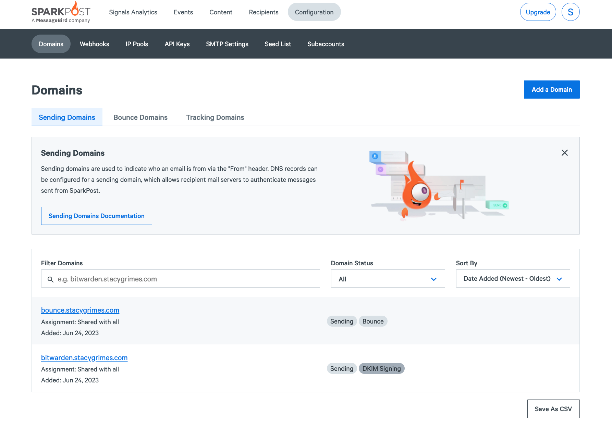
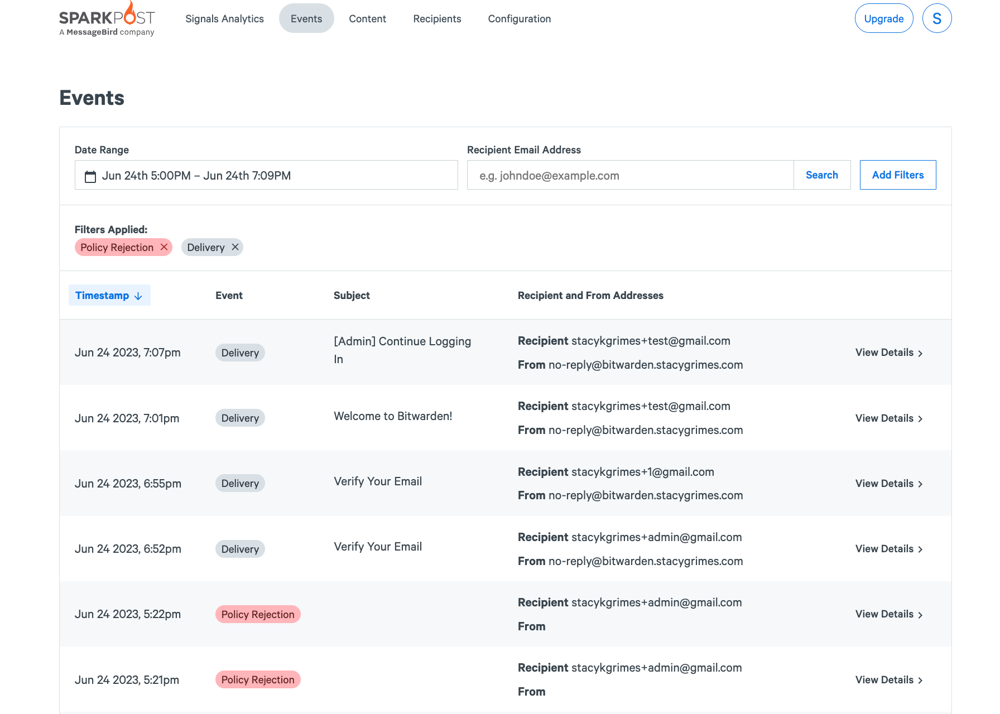
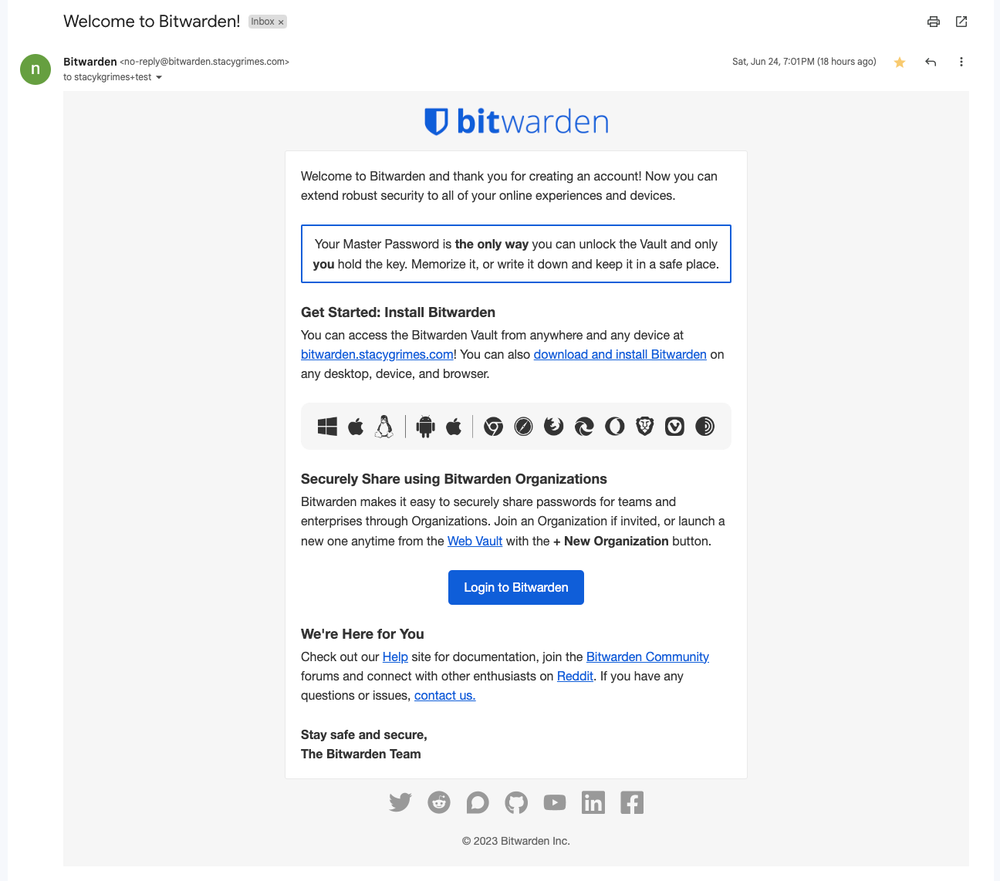
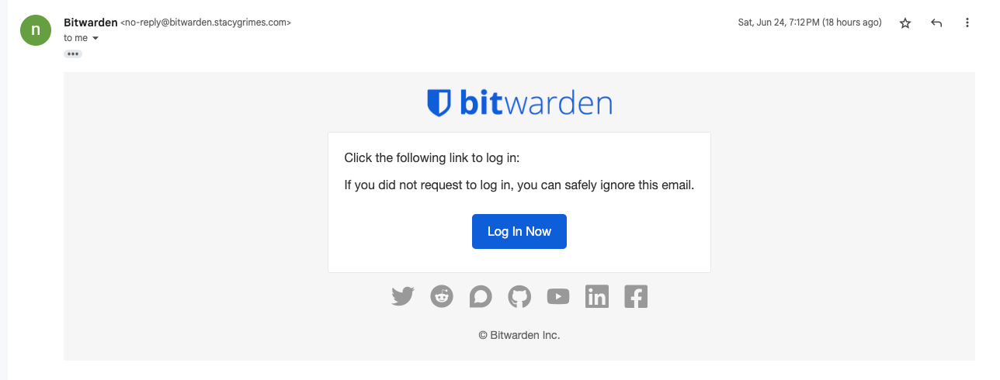
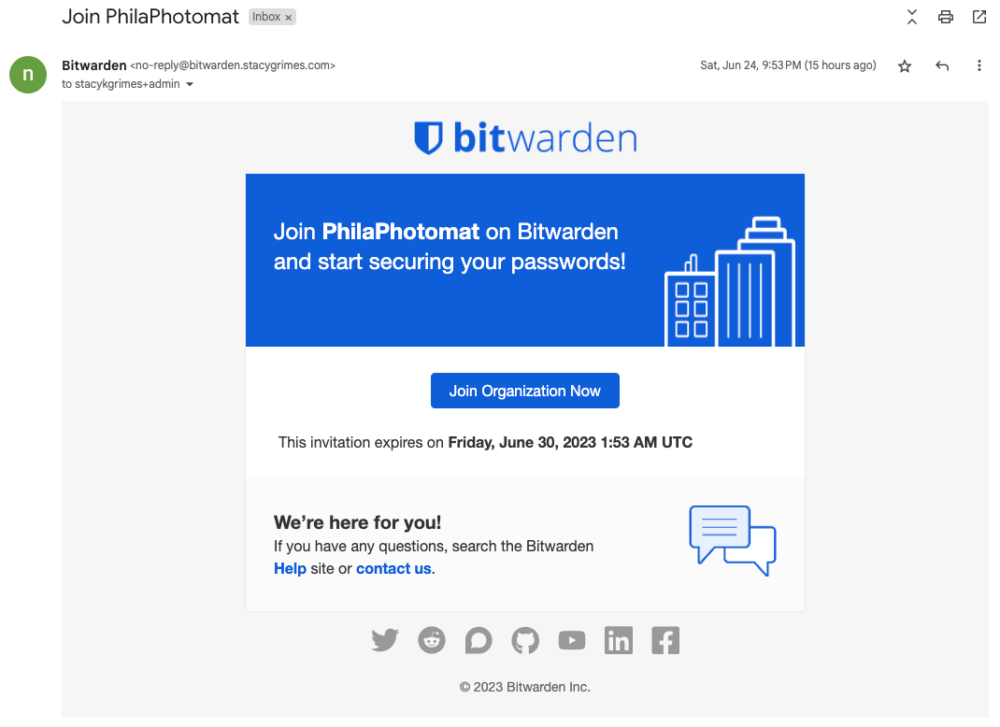
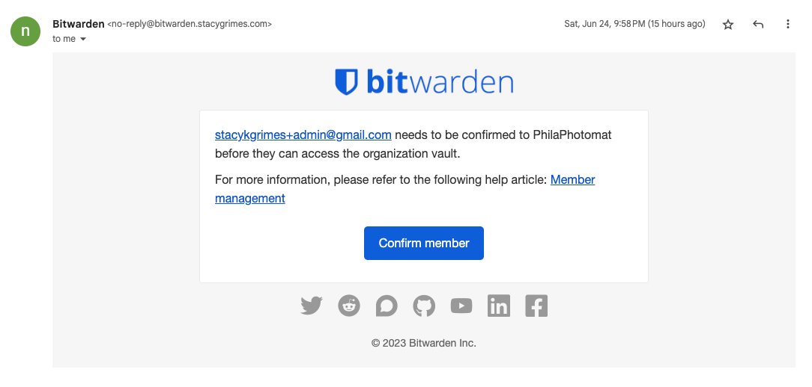
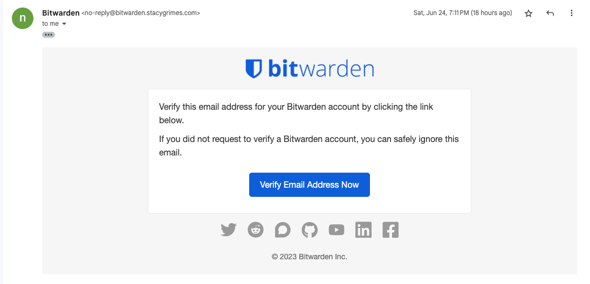
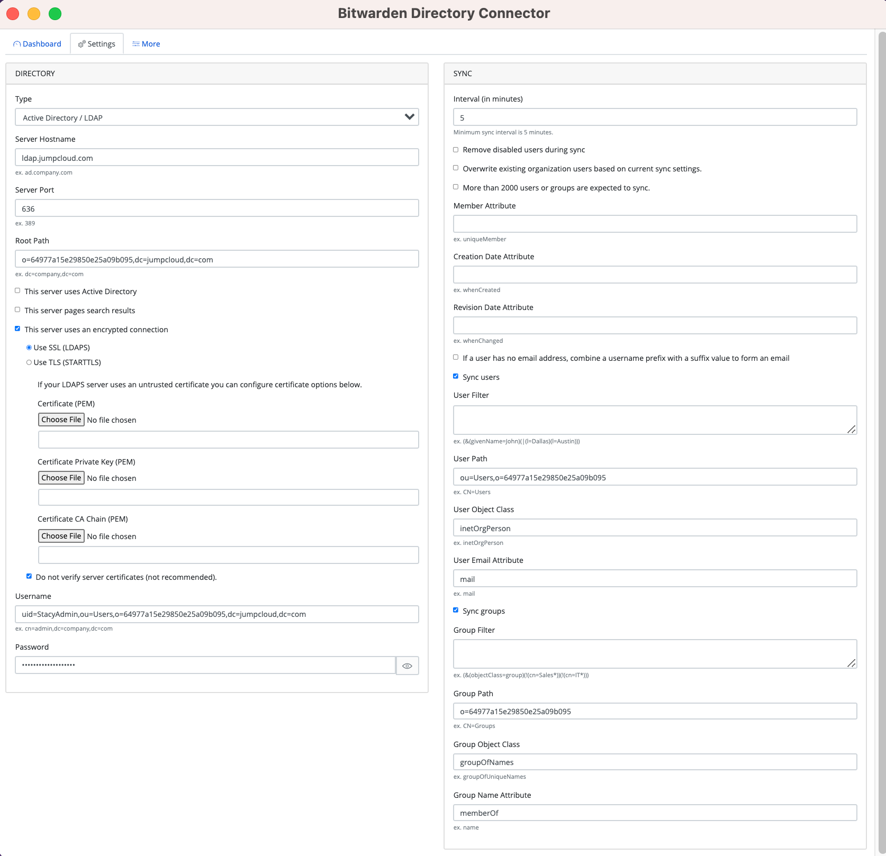
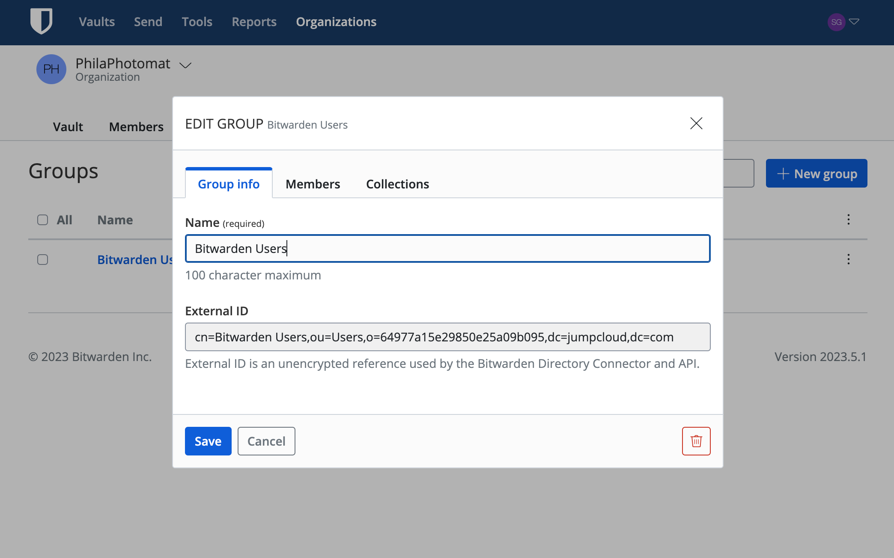
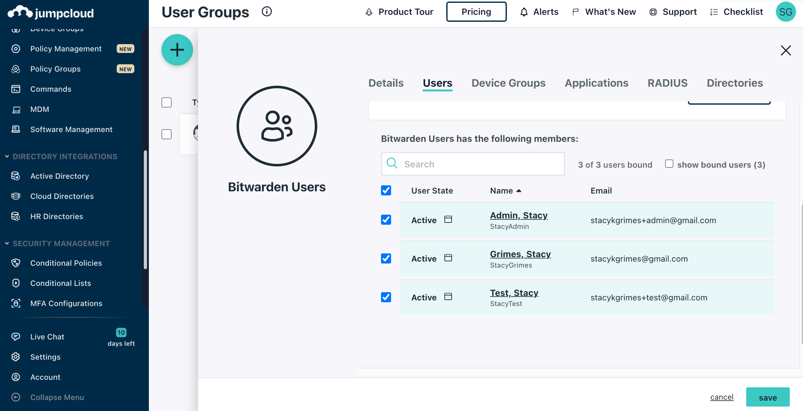

# Bitwarden Technical Assessment

### Provided Instructions
> 1. Install the Bitwarden server on Linux. (You can use any type of server certificate; Let's Encrypt, self-signed, public ca issued or private ca issued.)
> 2. Configure the server to use SMTP. If you don't yet have an existing SMTP Mail Server from which you can relay emails, consider services like SparkPost or > Mailgun which both have free test accounts.
> 3. Forward the email sent from your self-hosted server showing you created a new account on the server to myself and Aaron Marshall (amarshall@bitwarden.com).

> If you have extra time and want bonus points, you can sync users and groups using the Directory Connector. JumpCloud provides a free test account for LDAP which works really well. You can also choose to use any LDAP server, Active Directory, Azure, Google Workspace, Okta or OneLogin. Send a screenshot of your Directory Connector configuration and the list of People under the Organization admin area.

### Steps I took to configure:
- I decided to install Bitwarden utilizing the [Digital Ocean Droplet](https://bitwarden.com/blog/digitalocean-marketplace/), which was extremely easy to set up. I opted to generate an SSL certificate through Lets Encrypt (which I have used before).
- After getting Bitwarden fully installed and started up, I set up a DNS record, creating a subdomain as part of a domain I already own, and directed my newly created self hosted Bitwarden instance to it: https://bitwarden.stacygrimes.com
- I then created a Sparkpost account (I have used Sparkpost before so I was already familiar with it) and set up and verified **bitwarden.stacygrimes.com** as the Sending domain and **bounce.stacygrimes.com** as the Bounce domain.  I then generated a Sparkpost API key and used the provided SMTP configuration to setup the SMTP relay by editing **./bwdata/env/global.override.env**
- I created a test account with my self hosted instance, and Sparkpost event logs showed successful Injection of messages, but the first few tries failed due ["Unconfigured Sending Domain"](https://support.sparkpost.com/docs/user-guide/unconfigured-sending-domain) because the domain verification had not yet been fully validated. Once the domain was finally fully verified I was able to receive emails for account creation, email verification, and Admin login.
- I added the email address associated with Bitwarden Cloud account (stacykgrimes@gmail.com) to the admin configuration in ./bwdata/env/global.override.env and then was able to the Admin console via https://bitwarden.stacygrimes.com/admin
- I then was able to upload the organization License (which I had downloaded form my cloud account) to link my existing organization (PhilaPhotomat) to my self hosted instance. 
- Hurrah!!!

### Bonus!
- I created a JumpCloud Free account, and created a User directory and added three users: stacykgrimes+test@gmail.com, stacykgrimes+admin.com, stacykgrimes@gmail.com
- I then followed these [very helpful instructions](https://contributing.bitwarden.com/getting-started/enterprise/directory-connector/jumpcloud/) from the Bitwarden Contributing Docs to configure the Bitwarden Directory Connector specifically for JumpCloud LDAP.
- It took a few tries for me to get everything configured just right, but the test succeeded and I was able to succesfully sync the users to my organization.
  
### Supporting Evidence

**Sparkpost Setup**

**Received Emails**

**JumpCloud LDAP Configuration**

